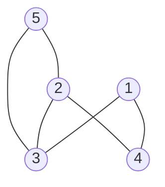
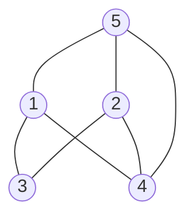

## 그래프(graph)란?

[그래프 설명 바로가기](https://trulyeven.github.io/posts/%EC%9E%90%EB%A3%8C%EA%B5%AC%EC%A1%B0-graph/)

---

## 인접 행렬 구현



```java
public class Main {
    public static void main(String[] args) {
        int n = 5;  // 그래프 정점 개수
        int[][] testGraph = new int[n+1][n+1];  // index 1부터
 
        inputEdge(testGraph, 1, 3);
        inputEdge(testGraph, 1, 4);
        inputEdge(testGraph, 2, 3);
        inputEdge(testGraph, 2, 4);
        inputEdge(testGraph, 2, 5);
        inputEdge(testGraph, 3, 5);
 
        print(testGraph);
    }

    // 그래프 출력 함수
    public static void print(int[][] testGraph) {
        for (int i = 1; i < testGraph.length; i++) {
            for (int j = 1; j < testGraph.length; j++)
                System.out.print(testGraph[i][j]+ " ");
            System.out.println();
        }
    }
 
    // 간선 유무 입력 함수
    public static void inputEdge(int[][] testGraph, int x, int y) {
        testGraph[x][y] = 1;  // 방향 그래프면 이 줄까지
        testGraph[y][x] = 1;  // 무방향 그래프라서 (1,2) (2,1) 모두 추가
    }
}
```

- 출력결과
```
0 0 1 1 0
0 0 1 1 1
1 1 0 0 1
1 1 0 0 0
0 1 1 0 0
```

## 인접 리스트 구현



```java
import java.util.ArrayList;

public class Main {
    public static void main(String[] args) {
        int n = 5;  //그래프 정점 개수
        ArrayList<ArrayList<Integer>> testGraph = new ArrayList<>();
 
        for (int i = 0; i <= n; i++)
            testGraph.add(new ArrayList<>()); // 각 노드 별 리스트 생성
        inputEdge(testGraph, 1, 3);
        inputEdge(testGraph, 1, 4);
        inputEdge(testGraph, 1, 5);
        inputEdge(testGraph, 2, 3);
        inputEdge(testGraph, 2, 4);
        inputEdge(testGraph, 2, 5);
        inputEdge(testGraph, 4, 5);
 
        print(testGraph);
    }

    // 그래프 출력 함수
    public static void print(ArrayList<ArrayList<Integer>> testGraph) {
        for (int i = 1; i < testGraph.size(); i++) {
            ArrayList<Integer> node = testGraph.get(i);
            System.out.print("[" + i + "] : ");
            for (int j = 0; j < node.size(); j++) {
                System.out.print(node.get(j));
                if (j != node.size() - 1) {
                    System.out.print(" -> ");
                }
            }
            System.out.println();
        }
    }
 
    // 간선 유무 입력 함수
    public static void inputEdge(ArrayList<ArrayList<Integer>> testGraph, int x, int y) {
        testGraph.get(x).add(y);
        testGraph.get(y).add(x);
    }
}
```

- 출력결과
```
[1] : 3 -> 4 -> 5
[2] : 3 -> 4 -> 5
[3] : 1 -> 2
[4] : 1 -> 2 -> 5
[5] : 1 -> 2 -> 4
```
