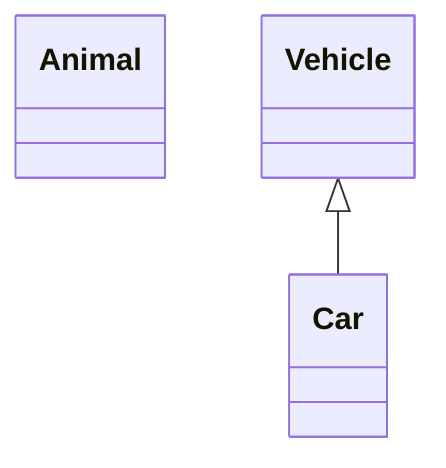

마크다운 (Markdown)은 마크업 언어의 일종이다. 존 그루버(John Gruber)[1]와 아론 스워츠(Aaron Swartz)[2]가 만들었다. HTML 문서 등과 달리, 읽기도 쓰기도 쉬운 문서 양식을 지향한다. 확장자는 .md 또는 .markdown을 사용한다.  
github page는 마크다운 언어를 사용하고 있다.

```
줄바꿈 : 띄어쓰기 2번, <br>   
수평선 : `---` `***`
```

# **제목(Header)**
---
```markdown
# h1
## h2
### h3
#### h4
##### h5
###### h6

h1
====

h2
----
```

# **강조** 
---
`*`, `_`, `~`를 사용한다.  
```markdown
*기울여쓰기*      
__굵게__
___기울여굵게___
~~취소선~~ 
<u>밑줄</u>  # html
```
*기울여쓰기*      
__굵게__  
___기울여굵게___  
~~취소선~~   
<u>밑줄</u>

# **리스트(Lists)**
---
## Ordered list
번호를 순서대로 쓰지 않아도 알아서 순서대로 정렬됨
```markdown
1. Firstly
4. Secondly
3. Thirdly
```

1. Firstly
4. Secondly
3. Thirdly

## Unordered list
`-`, `*`, `+` 사용

```markdown
- Chapter
  - Section
    * Paragraph1
    + Paragraph2
```

- Chapter
  - Section
    * Paragraph1
    + Paragraph2

## ToDo list
```markdown
- [ ] Job
  + [x] Step 1
  + [x] Step 2
  + [ ] Step 3
```

- [ ] Job
  + [x] Step 1
  + [x] Step 2
  + [ ] Step 3

## Description list
```markdown
궁금
: 설명해야지
설명
: 설명을 써야지
```

궁금
: 설명해야지

설명
: 설명을 써야지


# **표(Tables)**
---
```markdown
| Company                      | Contact          | Country |
|:----------------------------:|:-----------------|--------:|
| Alfreds Futterkiste          | Maria Anders     | Germany |
| Island Trading               | Helen Bennett    | UK      |
| Magazzini Alimentari Riuniti | Giovanni Rovelli | Italy   |
```

| Company                      | Contact          | Country |
|:----------------------------:|:-----------------|--------:|
| Alfreds Futterkiste          | Maria Anders     | Germany |
| Island Trading               | Helen Bennett    | UK      |
| Magazzini Alimentari Riuniti | Giovanni Rovelli | Italy   |
 > 두 번째 줄로 정렬  
 :-- 왼쪽 정렬
 :--: 가운데 정렬
 --: 오른쪽 정렬

 표 내에서 줄 바꿈 `<br>` 사용
  

# **링크(Links)**
---
```markdown
https://trulyeven.github.io
<https://trulyeven.github.io>
[사이트](https://trulyeven.github.io "over 시 나오는 설명")
```

https://trulyeven.github.io  
<https://trulyeven.github.io>  
[사이트](https://trulyeven.github.io "over 시 나오는 설명")

# **각주(Footnote)**
---

뭔가 설명이 필요한 내용[^footnote], 이것도 설명이 있음[^fn-nth-2].


# **수학(Mathematics)**
---
> 상단에서 math: true 필요(Chirpy theme)

The mathematics powered by [**MathJax**](https://www.mathjax.org/):

$$ \sum_{n=1}^\infty 1/n^2 = \frac{\pi^2}{6} $$

When $a \ne 0$, there are two solutions to $ax^2 + bx + c = 0$ and they are

$$ x = {-b \pm \sqrt{b^2-4ac} \over 2a} $$

# **차트 및 그래프(mermaid)**
---
> 상단에서 mermaid: true 필요(Chirpy theme)

flowchart, Sequence Diagram, Class Diagram, State Diagram 등등

[mermaid 문법 문서](http://mermaid.js.org/syntax/flowchart.html)


---

# **이미지(Images)**
---
크기 및 위치
```markdown
{: width="700" height="400" }
                                  {: .normal }
                                  {: .left }  
                                  {: .right }
                                  {: .shadow }    # 다크모드 X
_Image Caption_   # 위치 지정 시 캡션 추가 불가

# 이미지에 링크 넣기
[](https://kr.vuejs.org/)
```
Chirpy v5.0.0부터 지원 `{: w="700" h="400" }`


# **인용구(Block Quote)**
---
```markdown
> 인용구(Block Quote)
```
> 인용구(Block Quote)


# **코드(Code)**
---
## 파일 경로 하이라이트 -chirpy
```markdown
`/path/to/a/file.extend`{: .filepath}
```
`/path/to/a/file.extend`{: .filepath}

## Inline Code
```markdown
`인라인 코드`
```
`인라인 코드`

## *코드 블록(Code Block)*
````markdown
```markdown
앞의 {`} 3,4,5 개수로 안밖 블록 구분 가능
```
````
```
앞의 {`} 3,4,5 개수로 안밖 블록 구분 가능
```
### line number X : `plaintext` `console` `terminal` `nolineno` -chirpy
````markdown
```shell
python, markdown, '...' 
``` 
````

```shell
python, markdown, '...'
```

### Liquid Codes
> `{` `{` `}` `}`, `{` `%` `%` `}` 문법 사용시


```liquid

  This product's title contains the word Pack.

```


---

### *각주에서 되돌리기*

[^footnote]: 되돌아가기 버튼 ->
[^fn-nth-2]: 설명을 작성


# chirpy theme 문법
---
chirpy theme에서 제공하는 마크다운 문법

## **Front Matter**

chirpy theme 포스트 작성 시 포스트 페이지 맨 위에 작성

```markdown
---
title: TITLE
date: YYYY-MM-DD HH:MM:SS +/-TTTT     # timezone
categories: [TOP_CATEGORIE, SUB_CATEGORIE]
tags: [TAG]                    # 소문자로 작성
img_path: /img/path/           # post에서 쓸 이미지 파일 경로

image:                         # 미리보기 이미지
  path: /path/to/image
  width: 1000                  # in pixels
  height: 400                  # in pixels
  alt: image alternative text

pin: true           # 블로그에 게시물 상단 고정
toc: true           # 포스트 옆 헤더 바로가기
comments: true      # 댓글 기능
math: true          # 수학 공식, 성능 문제로 사용 시에만
mermaid: true       # 다이어그램 사용 시

---
```

## **프롬프트(prompt)** - chirpy theme
---
```markdown
> Example line for prompt.
{: .prompt-info }
```
> prompt-info.
{: .prompt-info }

```markdown
> Example line for prompt.
{: .prompt-tip }
```
> prompt-tip.
{: .prompt-tip }

```markdown
> Example line for prompt.
{: .prompt-warning }
``` 
> prompt-warning.
{: .prompt-warning }

```markdown
> Example line for prompt.
{: .prompt-danger }
```
> prompt-danger.
{: .prompt-danger }
