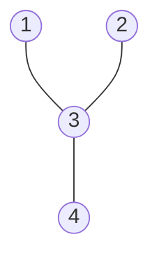
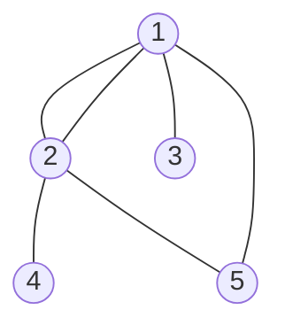
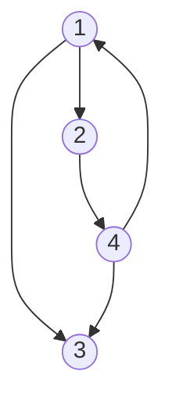
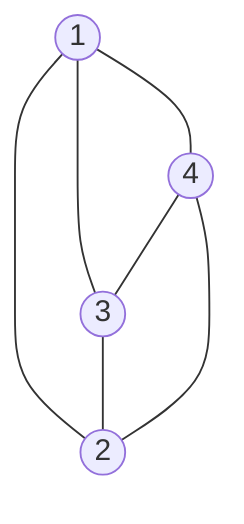
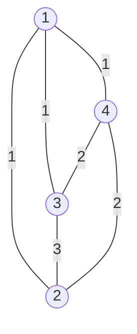
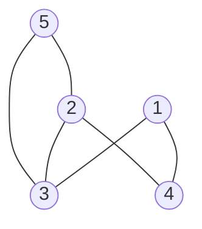
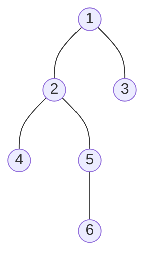

## 1. 그래프(graph)란?

정점(node, vertex)과 간선(edge)로 이루어진 자료구조

연결되어 있는 객체 간의 관계를 표현할 수 있는 자료구조이다

> 트리(tree)는 그래프의 일종이다. 트리는 정점마다 간선이 존재하며, 루트(root) 노드와 부모-자식 노드 개념이 존재한다.
{: .prompt-info }


> 정점 4개, 간선 3개인 그래프

---

## 2. 그래프 용어

| 용어 | 설명 |
| ---- | ---- |
| 정점(Vertex,Node) | 데이터를 저장하는 위치 |
| 간선(Edge) | 정점(노드)를 연결하는 선 <br> 링크(Link), 브랜치(Branch)
| 인접 정점(Adjacent Vertex) | 간선에 의해 직접 연결된 정점 |
|단순 경로(Simple Path)|경로 중에서 반복되는 정점이 없는 경로 <br> 같은 간선을 지나가지 않는 경로 |
| 사이클(Cycle) | 단순 경로의 시작 정점과 종료 정점이 동일할 때 |
| 차수(Degree) |무방향 그래프에서 하나의 정점에 인접한 정점의 수 |
| 진출 차수(In-Degree) | 방향 그래프에서 외부로 향하는 간선의 수|
| 진입 자수(Out-Degree) | 방향 그래프에서 외부에서 들어오는 간선의 수 |
| 경로 길이(Path Length) | 경로에 사용된 간선의 수 |

---

## 3. 그래프 종류

### 3.1. 무방향 그래프


간선에 방향이 없는 그래프

정점 n개일 때, 최대 간선 수 : $n(n-1)\over{2}$


### 3.2. 방향 그래프

두 정점을 연결하는 간선에 방향이 존재하는 그래프

간선이 가리키는 방향으로만 이동할 수 있다

정점 n개일 때, 최대 간선 수 : $n(n-1)$


### 3.3. 완전 그래프

한 정점에서 다른 정점과 모두 연결되어 있는 그래프


### 3.4. 가중치 그래프


간선에 가중치(비용)가 있는 그래프

---

## 4. 그래프 구현

구현 방법은 인접 행렬, 인접 리스트가 있다

### 4.1. 인접 행렬

인접 행렬이란 그래프의 정점을 2차원 배열로 만든다

정점 간에 연결되어 있다면 1, 아니라면 0 을 저장한다


```py
[[0, 0, 1, 1, 0],  # --> 1번 노드와 연결된 노드는 1
 [0, 0, 1, 1, 1],
 [1, 1, 0, 0, 1],
 [1, 1, 0, 0, 0],
 [0, 1, 1, 0, 0]]
```

장점

1. 모든 정점의 간선 정보가 담겨서 조회할 때 $O(1)$ 의 시간 복잡도
2. 인접 리스트에 비해 구현이 쉽다

단점

1. 모든 정점에 대해 간선 정보를 입력해야 하므로 생성할 때 $O(n^2)$의 시간 복잡도
2. 항상 2차원 배열이 필요하므로 필요 이상의 공간이 낭비

<br><br>

### 4.2. 인접 리스트

배열 또는 리스트 사용

정점의 개수만큼 헤드 노드가 있고, 각 정점에 인접한 정점들 리스트로 연결


```py
[[3, 4],  # --> 1번 노드와 연결된 노드 번호
 [3, 4, 5],
 [1, 2, 5],
 [1, 2],
 [2, 3]]
```

장점

1. 필요한 공간만 사용하기 때문에 공간 낭비 적음
2. 탐색 시 $O(n)$ 의 시간 복잡도
   
단점

1. 인접 행렬보다 구현 어려움

---

## 5. 그래프 순회(탐색)

 정점에서 출발하여 체계적으로 그래프의 모든 정점을 한번씩 방문하는 것이다. 
 
 대표적인 알고리즘으로 깊이 우선 탐색(DFS)와 너비 우선 탐색(BFS)이 있다.



### 5.1. 깊이 우선 탐색
: (DFS, Depth-First-Search)

> 1 -> 2 -> 4 -> 5 -> 6 -> 3

갈 수 있는 만큼 최대한 깊이 가고, 다시 이전 정점으로 돌아와서 가는 방식으로 순회

주로 재귀 호출과 스택을 사용해서 구현

### 5.2. 너비 우선 탐색
: (BFS, Breadth-First-Search, 넓이 우선 탐색)

> 1 -> 2 -> 3 -> 4 -> 5 -> 6

시작 정점에 인접한 모든 정점을 방문

인접한 모든 정점을 방문한 뒤, 다시 해당 정점의 인접한 정점을 방문하며 그래프를 순회

주로 큐와 반복문을 사용해서 구현

---

<br><br>


## 6. 코드로 구현

[JAVA 구현](https://trulyeven.github.io/posts/JAVA-graph/)
